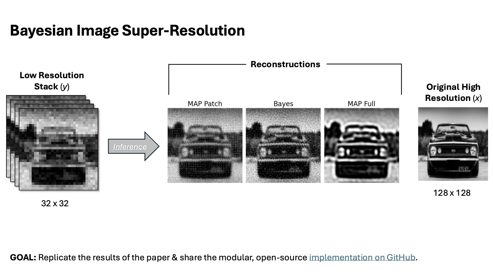

# 🖼️ Project Workflow README

This README explains how to run the optimization, generate plots, and create the final figures for the paper.

---

## 📄 Overview


The full writeup of our work is saved in this repo as  [`writeup.pdf`](./writeup.pdf). The original paper is also saved as [`original_paper.pdf`](./original_paper.pdf). 


## 🚀 Running the Optimization

Before running the optimization, open:

```bash
src/train.py
```

Update the parameters at the top of the file as needed.

Make sure to set:

- 📁 **Output directory**
- 🖼️ **Path to the high-resolution image**
- ⚙️ **Optimization parameters**

Then run:

```bash
python -m src.train
```

The optimization results will be saved to the output directory you specified.

---

## 📊 Generating Plots

To generate plots from the optimization results, open:

```bash
src/make_plots.py
```

Update the `results_dir` variable so that it points to the output directory used during training.

Then run:

```bash
python -m src.make_plots
```

The generated plots will be saved in a `plots/` subfolder inside the results directory.

---

## 🧩 Generating Figures

To generate the final figures for the paper, open:

```bash
figs.ipynb
```

In the first cell, update:

- 🏠 **Root directory**
- 📁 **Results directory**
- 📦 **Final output directory**

Then run all cells in the notebook.

The generated figure folder can then be dragged and dropped into the LaTeX project to include the figures in the paper.

---

## ✅ Summary

1. 🛠️ Update parameters in `src/train.py`
2. 🚀 Run the optimization with `python -m src.train`
3. 📊 Update `results_dir` in `src/make_plots.py`
4. 📈 Generate plots with `python -m src.make_plots`
5. 🧩 Update paths in `figs.ipynb`
6. 📄 Run the notebook and move the generated figures into the LaTeX document
